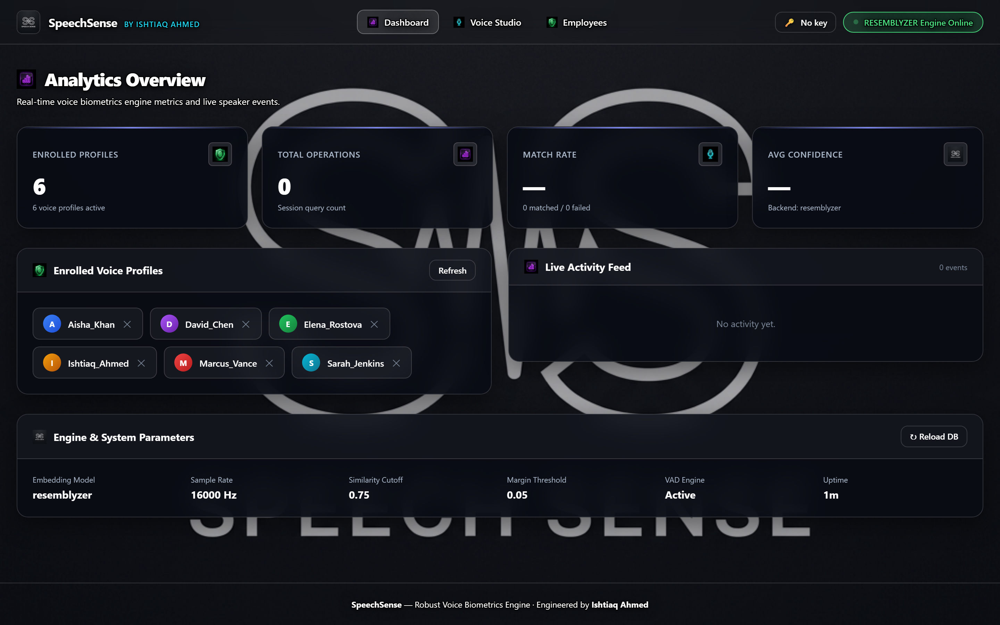
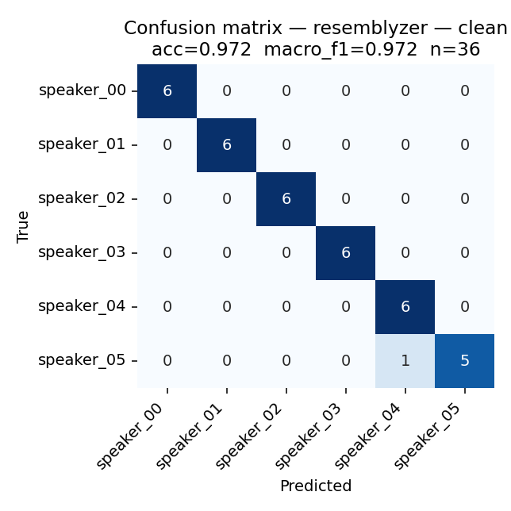
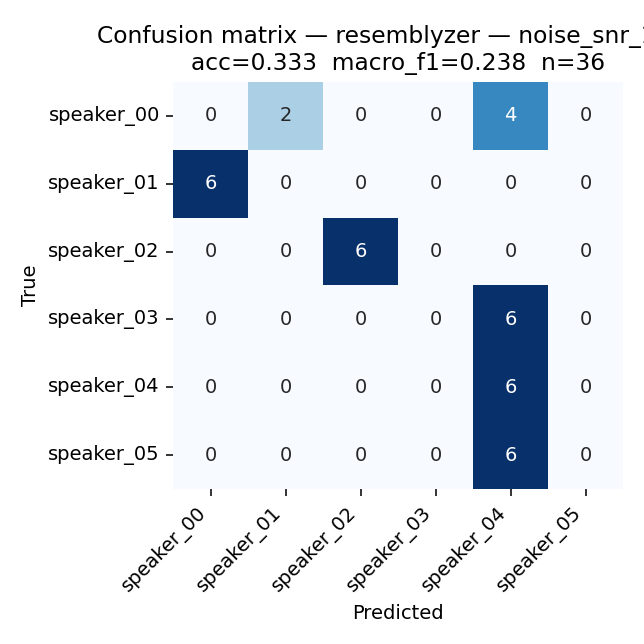

# robust-voice-recognition

**Engineered by Ishtiaq Ahmed** — Portfolio-grade speaker verification with a human-centric transparent glassmorphism UI, real-time prompt teleprompter sentences, employee dataset management, voice activity detection, calibrated confidence scores, speaker-disjoint evaluation harness, REST API, parallel batch processing, and offline fallback backends.

Built on top of [Resemblyzer](https://github.com/resemble-ai/Resemblyzer) (GE2E speaker embeddings, 256-D unit vectors) with a lightweight MFCC fallback so the pipeline runs — and the tests pass — even in environments that cannot download the pretrained model.

## Dashboard preview



<sub>Live analytics, enrolled voice profiles, activity feed, and engine parameters — served locally at `http://127.0.0.1:8000` via `speech-sense serve`. Additional tabs: **Voice Studio** ([screenshot](docs/screenshots/studio.png)) for live recording, teleprompter and biometric verification output, and **Employees** ([screenshot](docs/screenshots/employees.png)) for the `employees_audio/` roster with one-click "Enroll All Employees".</sub>

---

## What this project does

speech_sense is **speaker verification / identification**, not speech-to-text:

- **Enroll** — record or upload 1–3 short WAV clips of a speaker; the system averages their embeddings into a single voice-print.
- **Identify** — given a new clip, return the closest enrolled speaker plus similarity, margin, and a 0–1 confidence.
- **Verify** — given a clip and a claimed name, return whether the audio matches that enrolled speaker.
- **Teleprompter Sentences** — interactive prompt cards with phonetically balanced and biometric phrases for users to read while recording.
- **Employee Audio Corpora** — organized dataset folder (`employees_audio/`) containing subfolders named by employees ONLY with pre-generated voice clips and 1-click batch enrollment.

## Features

| Category | Feature |
|----------|---------|
| Core | Speaker enrollment, identification, and 1-vs-1 verification |
| **UI/UX** | **Transparent Glassmorphic Interface**, Live Audio Waveform Visualizer, Teleprompter Prompt Reader, Employee Audio Directory |
| **Corpora** | Single-folder employee dataset structure (`employees_audio/`) with subfolders named by employees only |
| Robustness | Voice Activity Detection (energy + zero-crossing) trims silence and rejects empty audio before inference |
| Scoring | Calibrated **confidence** derived from cosine similarity + margin over second-best speaker |
| Evaluation | **Speaker-disjoint** enroll/test split (no leakage), confusion matrix, per-class F1, noise-condition sweep |
| Interfaces | Animated browser demo, FastAPI REST service, streaming (near-real-time) identifier, CLI (`speech-sense …`) |
| **Scale** | Parallel batch enrollment / identification over directories using a process pool — handles GB-scale corpora |
| Portability | Backend abstraction — Resemblyzer at runtime, MFCC-mean fallback for CI/tests, optional ONNX export |
| **Security** | Data-only `.npz` database (no pickle, so no code execution), optional constant-time API key, request size/duration/count caps, no traceback leakage, security headers, capped score disclosure |
| **Operations** | Non-blocking inference, atomic durable writes, corrupt-database quarantine, degraded-but-alive startup, `/healthz` + `/readyz`, structured logging with request ids |
| Config | All knobs come from a `Config` dataclass with **validated** env-var overrides (`SPEECH_SENSE_*`) — no hardcoded paths, and a bad value warns and falls back rather than crashing |


## Repository layout

```
robust-voice-recognition/
├── src/speech_sense/                 # Python package (import path is `speech_sense`)
│   ├── config.py                     # Config dataclass + validated env-var overrides
│   ├── audio.py                      # I/O, resampling, noise injection, framing
│   ├── vad.py                        # Voice activity detection
│   ├── embedding.py                  # Resemblyzer + MFCC backends
│   ├── database.py                   # Speaker DB (atomic .npz persistence)
│   ├── verifier.py                   # Single-clip enroll / identify / verify
│   ├── batch.py                      # Parallel batch enroll + identify over directories
│   ├── streaming.py                  # Near-real-time chunked inference
│   ├── evaluate.py                   # Speaker-disjoint splits + metrics + plots
│   ├── benchmark.py                  # Latency / RTF / size measurements
│   ├── api.py                        # FastAPI service
│   ├── cli.py                        # `speech-sense` CLI
│   ├── __main__.py                   # `python -m speech_sense …`
│   └── web/                          # Dashboard (no build step, no CDN, offline-safe)
│       ├── index.html                # Markup
│       ├── styles.css                # Logo-backed transparent theme
│       ├── app.js                    # Client logic
│       └── assets/                   # logo.png (the page background) + nav icons
├── tests/                            # 151 tests
│   ├── conftest.py                   # Synthetic speakers, deterministic seeds
│   ├── test_config.py                # Env-var validation at the trust boundary
│   ├── test_hardening.py             # Regression tests for every production fix
│   └── test_{audio,vad,database,verifier,streaming,evaluate,api,batch,cli}.py
├── scripts/
│   ├── generate_employee_dataset.py  # Rebuild employees_audio/ (deterministic)
│   └── export_onnx.py                # Export Resemblyzer to ONNX
├── employees_audio/<Employee_Name>/  # Synthetic sample corpus, one folder per person
├── docs/evaluation/                  # Confusion matrices from the evaluation harness
├── data/                             # Scratch space for your own datasets (gitignored)
├── .env.example                      # Every SPEECH_SENSE_* variable, documented
├── pyproject.toml
├── requirements.txt
└── requirements-dev.txt
```

## Installation

```bash
python -m venv .venv
# On Windows:  .venv\Scripts\activate
# On macOS/Linux: source .venv/bin/activate

pip install -e ".[model,api,dev]"
```

Extras:
- `model` — installs Resemblyzer (real speaker embeddings). ~1 GB via torch.
- `api` — installs FastAPI + Uvicorn + python-multipart for the REST service.
- `dev` — pytest, coverage, httpx, onnxruntime.
- `mic` — sounddevice for microphone recording from the CLI.

If you cannot install Resemblyzer (e.g. a slim CI box), everything still runs on the MFCC fallback — you'll get a clear warning on stderr and lower accuracy.

## Quick start

### CLI

```bash
# Enroll from three WAVs
speech-sense enroll --name alice --audio alice_1.wav alice_2.wav alice_3.wav

# Identify a new clip
speech-sense identify --audio question.wav
#   → {"speaker": "alice", "is_known": true, "similarity": 0.87,
#      "margin": 0.14, "confidence": 0.94, ...}

# 1-vs-1 verification (exit code 0 == match)
speech-sense verify --name alice --audio question.wav

# List / delete
speech-sense list
speech-sense delete --name alice

# Serve the REST API + browser demo on http://127.0.0.1:8000
speech-sense serve

# Run the built-in evaluation on synthetic speakers (no dataset needed)
speech-sense evaluate --out reports/

# Benchmark encoder latency
speech-sense benchmark

# Record from the mic (requires the [mic] extra)
speech-sense record --duration 5 --out clip.wav

# Interactive record/enroll/identify loop
speech-sense repl
```

Every subcommand is also reachable as `python -m speech_sense …`, which works
before an editable install exists. Expected failures (missing file, unknown
speaker, unreadable audio) print a one-line message and a non-zero exit code;
`--log-level DEBUG` adds the traceback.

### Batch / parallel (GB-scale corpora)

Layout your dataset one folder per speaker:

```
dataset/
├── alice/
│   ├── take_001.wav
│   ├── take_002.wav
│   └── ...
├── bob/
│   └── ...
└── carol/
    └── ...
```

Enroll everything in parallel (uses `SPEECH_SENSE_WORKERS` or `CPU-1` by default):

```bash
speech-sense batch-enroll --dataset ./dataset --workers 8
```

Identify a whole folder of queries in one shot:

```bash
speech-sense batch-identify --directory ./queries --out results.json
```

Both commands stream progress to stderr and produce structured JSON on stdout / to `--out`. Bad clips are logged as `skipped` and never crash a run.

The API mirrors this:

```bash
curl -F "name=alice" -F "files=@a1.wav" -F "files=@a2.wav" -F "files=@a3.wav" \
     http://localhost:8000/batch/enroll

curl -F "files=@q1.wav" -F "files=@q2.wav" \
     http://localhost:8000/batch/identify
```

### REST API

```bash
speech-sense serve --host 0.0.0.0 --port 8000
```

Interactive docs at `http://localhost:8000/docs`; the browser demo is served at `/`.

| Method | Endpoint | Auth | Body |
|--------|----------|:----:|------|
| GET | `/healthz` | open | — liveness + backend info (503 when degraded) |
| GET | `/readyz` | open | — readiness: is the encoder actually loaded? |
| GET | `/prompts` | open | — phonetically balanced recording sentences |
| GET | `/speakers` | 🔑 | — |
| GET | `/analytics` | 🔑 | — dashboard metrics: operations, match rate, activity feed |
| GET | `/employees` | 🔑 | — employee audio directory listing |
| DELETE | `/speakers/{name}` | 🔑 | — |
| POST | `/enroll` | 🔑 | `name=…`, `files=<clip>[, <clip>, …]` (multipart) |
| POST | `/identify` | 🔑 | `file=<clip>` (multipart) |
| POST | `/verify` | 🔑 | `name=…`, `file=<clip>` (multipart) |
| POST | `/employees/enroll-all` | 🔑 | — batch-enrols the employee corpus (409 if one is already running) |
| POST | `/batch/enroll` | 🔑 | `name=…`, `files=<clip>…` — skips bad clips gracefully |
| POST | `/batch/identify` | 🔑 | `files=<clip>…` — one row per file, order preserved |
| POST | `/reload` | 🔑 | — rereads the database from disk |

🔑 routes require an `X-API-Key` header **only when `SPEECH_SENSE_API_KEY` is
set**. Unset (the default) leaves the service open, which is right for a local
demo and wrong for anything else — `speech-sense serve` warns if you bind to a
non-loopback address without a key. The probe routes stay open regardless, so
an orchestrator can always tell a locked-down service from a dead one.

Example:

```bash
curl -F "name=alice" -F "files=@alice_1.wav" -F "files=@alice_2.wav" \
     http://localhost:8000/enroll

curl -F "file=@question.wav" http://localhost:8000/identify
```

### Dashboard — the primary way to try this

Open `http://127.0.0.1:8000/` after `speech-sense serve`.

The whole dashboard sits on top of `web/assets/logo.png` — the logo *is* the
page background, fixed and full-bleed, and every panel above it is genuinely
transparent (a 3.5% white wash and a hairline border) so the artwork reads
through from edge to edge. Legibility comes from one fixed scrim plus a dark
halo on every text layer, not from opaque cards; tune `--scrim` in
`styles.css` to trade artwork for contrast.

Three plain files, no build step, no CDN, no bundler — `index.html`,
`styles.css`, `app.js`. Offline-friendly by design.

The recorder captures with `MediaRecorder` and then **decodes and re-encodes to
16-bit PCM WAV in the browser** before uploading. That matters: `MediaRecorder`
emits WebM/Opus whatever MIME type you ask it for, and shipping that to the
server made it fall back to librosa, which needs ffmpeg installed. Converting
client-side means the server only ever sees a format libsndfile handles
natively — browser enrolment works on a machine with no ffmpeg at all.

Works in Chrome/Edge/Firefox. Microphone capture needs a secure context
(HTTPS, or `localhost`); the dashboard says so plainly instead of failing
silently, and file upload works everywhere.

It has three pages:

**Analytics Dashboard:**
- Real-time stat cards (speakers enrolled, operations, match rate, avg confidence)
- Enrolled voice profiles with one-click delete
- Live activity feed with timestamped events
- System configuration panel showing backend, sample rate, thresholds, uptime

**Voice Studio:**
- Interactive prompt teleprompter with 6 phonetically balanced sentences
- Microphone recording with live waveform visualization
- Identify / Enroll mode switching with 3-take enrollment progress
- Drag-and-drop WAV file upload
- Full results panel with per-speaker score ranking

**Employee Corpora:**
- Employee audio directory listing with clip counts
- One-click "Enroll All Employees" batch action

> Run `speech-sense serve` and open the UI — it's the intended primary demo.

### Python

```python
from speech_sense import SpeakerVerifier, SpeakerDatabase
from speech_sense.audio import load_wav

verifier = SpeakerVerifier(database=SpeakerDatabase.load("speakers.npz"))

verifier.enroll_from_files("alice", ["alice_1.wav", "alice_2.wav"])
verifier.database.save("speakers.npz")

result = verifier.identify(load_wav("question.wav"))
print(result.to_dict())
```

### Streaming (near-real-time)

```python
from speech_sense import SpeakerVerifier
from speech_sense.streaming import StreamingIdentifier, iter_file_chunks
from speech_sense.audio import load_wav
from speech_sense.config import DEFAULT

verifier = SpeakerVerifier()
stream = StreamingIdentifier(
    verifier=verifier,
    on_event=lambda e: print(f"{e.t_seconds:.1f}s  {e.result.to_dict()}"),
)
for chunk in iter_file_chunks(load_wav("long.wav"), DEFAULT.sample_rate // 2):
    stream.process_chunk(chunk)
```

## Confidence semantics

Every result carries three numbers, not one:

| Field | Range | Meaning |
|-------|-------|---------|
| `similarity` | `-1..1` | Raw cosine between the query embedding and the winning speaker. |
| `margin` | `0..2` | Gap between winner and second-best speaker. Small margin = ambiguous. |
| `confidence` | `0..1` | Calibrated sigmoid over similarity + margin. High-similarity but low-margin (identical-twin case) yields a moderate confidence, not a high one. |
| `is_known` | bool | `similarity ≥ threshold` **and** `margin ≥ margin_threshold`. |
| `contains_speech` | bool | VAD verdict on the incoming audio. Silent inputs never claim a speaker. |

Defaults live in `speech_sense/config.py` (`similarity_threshold=0.75`, `known_speaker_margin=0.05`). Override per-instance by passing a `Config`, or globally via environment variables:

```bash
export SPEECH_SENSE_SIMILARITY_THRESHOLD=0.82
export SPEECH_SENSE_WORKERS=16
export SPEECH_SENSE_DATABASE_PATH=/data/voice_prints.npz
export SPEECH_SENSE_API_KEY=$(openssl rand -hex 32)   # required off localhost
speech-sense serve --host 0.0.0.0
```

Every field of `Config` has a matching `SPEECH_SENSE_<FIELD_NAME>` env var —
see [`.env.example`](.env.example) for the full annotated list. Nothing in the
codebase is hardcoded.

Environment variables are treated as a trust boundary. An unparseable or
out-of-range value is **ignored with a `WARNING` and replaced by the
documented default**, so a typo in a deployment variable cannot put a 24/7
service into a crash loop. The same value passed directly to `Config(...)`
raises instead — that's a bug in calling code and should be loud.

## Running in production

| Concern | What the service does |
|---------|-----------------------|
| Blocking work | Every embedding call is dispatched with `run_in_threadpool`; nothing CPU-bound runs on the event loop, so one 200 ms inference doesn't stall every other connection. |
| Request limits | Per-file byte cap, per-request file cap, and a **decoded-duration** cap — a few MiB of compressed audio can otherwise expand to hours of PCM. |
| Startup failure | If the encoder can't be built the process still serves `/healthz` (503 + the real reason) instead of exiting into a restart loop. |
| Error handling | A global handler logs the exception with a request id and returns only that id. No traceback, path, or version ever reaches a client. |
| Durability | Database writes are atomic (temp file + `os.replace`); a crash mid-write leaves the previous database intact. A corrupt file is quarantined to `<path>.corrupt-<ts>` and the service starts empty rather than refusing to boot. |
| Concurrency | The speaker database is lock-guarded, so a read during a concurrent enrolment can't observe a half-mutated roster. |
| Observability | Structured access log with method, path, status, duration and request id; `X-Request-ID` on every response. |
| Auth | Optional `X-API-Key` (constant-time compare) on every route that mutates state, costs CPU, or discloses the roster. |
| Headers | `X-Content-Type-Options`, `X-Frame-Options`, `Referrer-Policy` on every response. CORS is off unless you list origins. |

Batch jobs get the same treatment: an unreadable file, a worker killed by the
OOM reaper, and an environment where no process pool can be created at all are
each handled — the first two as a per-file error, the last by finishing the
run serially. A job that dies 80% of the way through a million clips is worse
than a slow one.

## Testing

```bash
pytest -q
```

151 tests, split across:

- **config** — env-var validation, out-of-range fallback, blank-is-unset, auth/CORS helpers.
- **audio** — I/O round-trip, resampling, noise-injection SNR, frame maths, NaN sanitisation.
- **vad** — silence rejection, speech detection, trimming, tiny-burst rejection, **steady-level speech regression**.
- **database** — save/load, atomicity, corrupt-file quarantine, mixed-dimension handling, name validation.
- **verifier** — enroll / identify / verify, silence-as-adversarial-input, confidence monotonicity, noise robustness.
- **streaming** — event emission, silence gating, window bounding, reset.
- **evaluate** — **speaker-disjoint split (no leakage)**, metrics, PNG generation.
- **api** — every endpoint, invalid-audio 400, persistence across restarts, `/` serves the dashboard.
- **batch** — directory enrollment, per-file error isolation, serial fallback, encoder reuse, parallel smoke test (opt-in).
- **cli** — enroll+identify round-trip, list/delete, all subcommands present.
- **hardening** — one regression test per production bug fixed: request limits, auth gate, degraded startup, traceback suppression, dimension mismatch, score capping, short-clip encoding.

Tests use synthetic speakers (per-speaker formant fingerprints) so nothing
needs to be downloaded and CI stays offline-safe. Speaker fingerprints are
seeded with `zlib.crc32`, not `hash()` — Python salts string hashing per
process, so the suite used to generate different voices on every run and pass
or fail depending on `PYTHONHASHSEED`.

## Evaluation results

Both backends were evaluated on the built-in synthetic dataset with the built-in speaker-disjoint split (2 clips enroll, 6 clips test per speaker, 6 speakers, seed=42) — reproducible with:

```bash
speech-sense --backend resemblyzer evaluate --out reports/ --speakers 6 --clips 8
```

| Backend | Condition | Accuracy | Macro-F1 |
|---------|-----------|----------|----------|
| **Resemblyzer** | clean | **0.972** | **0.972** |
| Resemblyzer | + white noise @ 20 dB SNR | 0.833 | 0.778 |
| Resemblyzer | + white noise @ 10 dB SNR | 0.333 | 0.238 |
| Resemblyzer | + white noise @ 5 dB SNR | 0.194 | 0.098 |
| **MFCC fallback** | clean | 1.000 | 1.000 |
| MFCC fallback | + white noise @ 20 dB SNR | 1.000 | 1.000 |
| MFCC fallback | + white noise @ 10 dB SNR | 0.472 | 0.337 |
| MFCC fallback | + white noise @ 5 dB SNR | 0.250 | 0.131 |

**Reading these numbers honestly**: the synthetic dataset is harmonic tones with per-speaker formant shifts — that's what lets everything ship without a dataset dependency. On real speech, Resemblyzer routinely reports EER < 2% (see the [GE2E paper](https://arxiv.org/abs/1710.10467)); the low-SNR degradation shown above is what it looks like when a model trained on real speech is given synthetic tones under noise. The MFCC fallback happens to do *better* on synthetic tones simply because both signals look similar in cepstral space — this reverses on real audio, which is why Resemblyzer is the default.

Confusion matrices:





## Benchmarks

Measured on this machine (CPU, batch=1, 3-second clips):

| Backend | Median latency | p95 latency | Throughput | Real-time factor | Model size |
|---------|---------------:|------------:|-----------:|-----------------:|-----------:|
| Resemblyzer | 15.9 ms | 16.9 ms | 62.8 clips/s | 0.005× (≈200× real-time) | 5.4 MB |
| MFCC | 2.8 ms | 3.3 ms | 356.1 clips/s | 0.001× (≈1000× real-time) | — |

Reproducible with `speech-sense benchmark`.

## Optional: export to ONNX

```bash
python scripts/export_onnx.py --out models/voice_encoder.onnx
```

## Architecture notes

- **VAD is coarse, and peak-relative.** A frame counts as speech when its RMS clears a fraction of the *loudest* frame in the clip plus a small absolute floor. The earlier rule compared each frame against `1.5 × percentile(energies, 30)`, which has a degenerate fixed point: in a clip recorded at a steady level the 30th percentile *is* speech energy, nothing clears 1.5× it, and a perfectly good recording came back as pure silence. Upgrading to Silero-VAD is still a drop-in swap behind the same interface — every function is expressed in terms of one `frame_decisions` array. Marked in code with a `ponytail:` note.
- **Backend abstraction.** `SpeakerEncoder.load("auto"|"resemblyzer"|"mfcc")` picks the right encoder. Downstream code doesn't know or care which one is active. `auto` falls back to MFCC on *any* construction failure — a missing weights download or an incompatible torch build, not just `ImportError`.
- **`.npz` only, never `pickle`.** The database is data-only, so a maliciously modified `speakers.npz` cannot execute code. An earlier version accepted legacy `.pkl` files for migration; that was arbitrary code execution against anyone who pointed `--database` at an untrusted file, and it has been removed.
- **One embedding dimension per database.** Enrolling under one backend and querying under another used to raise on the matrix multiply, so *every* `/identify` returned 500 until someone deleted the file. Mixing is now refused at write time and reported as an actionable reason at read time.
- **Scores are capped.** A result carries the top `SPEECH_SENSE_TOP_K_SCORES` speakers, not the whole roster — returning everything let one unauthenticated request enumerate every enrolled person and made responses grow linearly with headcount.
- **Streaming is single-threaded.** Adequate for microphone rates; if throughput ever matters, move the encoder call to a worker thread — the buffer maths doesn't change.

## Known limitations (be honest)

- **Small enrollment set.** Averaging 1–3 clips is a reasonable starting point but the voice-print stability tops out around 5–10 clips.
- **Fixed similarity threshold.** No per-speaker calibration; a threshold of 0.75 works well on Resemblyzer's 256-D unit sphere but should be tuned on your target data. EER-based threshold learning is a good next step.
- **Closed-set identification only.** `identify()` reports the best match plus `is_known`; a proper open-set rejector (e.g., score normalisation à la AS-Norm) would tighten the false-accept rate on unseen speakers.
- **VAD is energy-based.** Loud non-speech (music, noise) will be accepted as speech. Silero-VAD is the fix — the interface is ready for it.
- **Synthetic evaluation only.** The bundled dataset lets everything reproduce without downloads, but numbers on real speech will differ. Plug in [VoxCeleb1-O](https://www.robots.ox.ac.uk/~vgg/data/voxceleb/vox1.html) or LibriSpeech dev-clean to measure real EER.
- **No liveness / anti-spoofing.** A high-quality recording of an enrolled speaker will pass. Production deployments need liveness detection (e.g., text-dependent challenge, ASVspoof-style detector).

## Roadmap

- Silero VAD backend (swap-in).
- Per-speaker threshold calibration from held-out data.
- Open-set rejector with score normalisation.
- Real-dataset evaluation script for VoxCeleb1-O.
- Docker image for the API.
- Liveness / anti-spoofing pass.

## A note on the sample data

`employees_audio/` contains **synthetic** audio generated by
`scripts/generate_employee_dataset.py` — no real person is recorded, and the
run is reproducible. Real voice recordings and the `speakers.npz` voice-prints
derived from them are biometric data: both are gitignored, and neither should
be committed. Point `SPEECH_SENSE_EMPLOYEES_AUDIO` at a directory outside the
repository when working with real audio.

## License

MIT — see [LICENSE](LICENSE).
